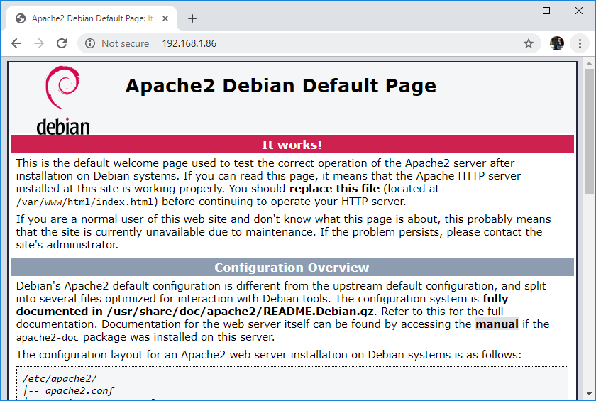

# Hướng Dẫn Raspberry Pi: Cài đặt Apache + MySQL + PHP (LAMP)

1. ___Cập nhật và nâng cấp__

    ```
    $ sudo apt update && sudo apt upgrade -y
    ```
1. __Cài đặt Apache2 trên Raspberry Pi__
    * Cài đặt Apache2:
        ```
        $ sudo apt install apache2 -y
        ```
    * Để Kiểm tra bạn di chuyển đến thư mục _/var/www/html_ và liệt kê các tệp và thư mục:
        ```
        $ cd /var/www/html
        $ ls -al
        ```
    * Nếu có tệp index.html thì tiếp theo xem ip của pi:

        ```
        $ hostname -I
        ```
    * Trên trình duyệt của thiết bị bất kì kết nối cùng chung một mạng truy cập vào ip của pi, ví dụ:

        


1. __Cài đặt PHP trên Raspberry Pi__
    * Vẫn tại thư mục _/var/www/html_, cài đặt PHP:

        ```
        sudo apt install php -y
        ```

    * Bạn có thể xóa tệp index.html trong thư mục _/var/www/html_ thay bằng tệp index.php( nhớ trong tệp viết bằng code php nhé) rồi restart Apache2:

        ```
        $ sudo service apache2 restart
        ```
1. __Cài đặt MySQL (Máy chủ MariaDB) trên Raspberry Pi__
    * Vẫn tại thư mục _/var/www/html_, cài đặt MySQL:
        ```
        $ sudo apt install mariadb-server php-mysql -y
        $ sudo service apache2 restart
        ```

    * Tăng bảo mật cho MySQL của bạn:
        ```
        $ sudo mysql_secure_installation
        ```
        _Lưu ý:_
        * Bạn sẽ được yêu cầu Nhập mật khẩu hiện tại cho người chủ (nhập mật khẩu an toàn): nhấn Enter
        * Gõ vào Y và nhấn Enter để Đặt mật khẩu gốc
        * Nhập mật khẩu tại lời nhắc Mật khẩu mới: và nhấn Enter. Quan trọng: hãy nhớ mật khẩu gốc này, vì bạn sẽ cần nó sau này
        * Nhập Y để Xóa người dùng ẩn danh
        * Nhập Y để Không cho phép đăng nhập root từ xa
        * Nhập Y để Xóa cơ sở dữ liệu thử nghiệm và truy cập vào nó
        * Nhập Y để Tải lại bảng đặc quyền ngay bây giờ
    

    * Nếu bạn gặp bất kỳ lỗi nào khi đăng nhập vào phpMyAdmin, bạn có thể cần tạo một người dùng mới để đăng nhập. Các lệnh đó sẽ tạo một người dùng mới với tên (quản trị viên) và mật khẩu (your_password).
        ```
        $ sudo mysql --user=root --password
        > create user admin@localhost identified by 'your_password';
        > grant all privileges on *.* to admin@localhost;
        > FLUSH PRIVILEGES;
        > exit;
        ```
1. __Cài đặt phpMyAdmin trên Raspberry Pi__
    * Vẫn tại thư mục _/var/www/html_ ,cài đặt phpMyAdmin trên Raspberry Pi:
        ```
        sudo apt install phpmyadmin -y
        ```
    * Bật tiện ích mở rộng PHP MySQLi và khởi động lại Apache2 để các thay đổi có hiệu lực:
        ```
        $ sudo phpenmod mysqli
        $ sudo service apache2 restart
        ```
    * Xong rồi truy cập vào http://{ ip }/phpmyadmin, vd: http://192.168.1.86/phpmyadmin
    * Nếu báo lỗi Not Found thì bạn phải chuyển thư mục phpadmin sang _/var/www/html_:
        ```
        $ sudo ln -s /usr/share/phpmyadmin /var/www/html/phpmyadmin
        ```
    * Kiểm tra xem thư mục đã được chuyển sang hay chưa:
        ```
        $ ls
        ```
    * Xong rồi truy cập lại đường dẫn http://{ ip }/phpmyadmin ( _nếu tài khoản mật khẩu sai xem lại phần lưu ý Cài đặt MySQL (Máy chủ MariaDB) trên Raspberry Pi_ )

## Chúc các bạn thành công  